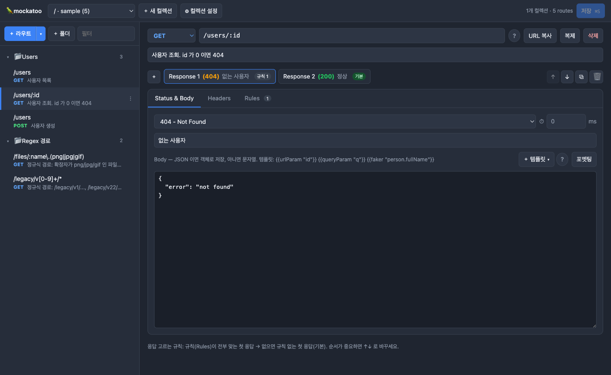
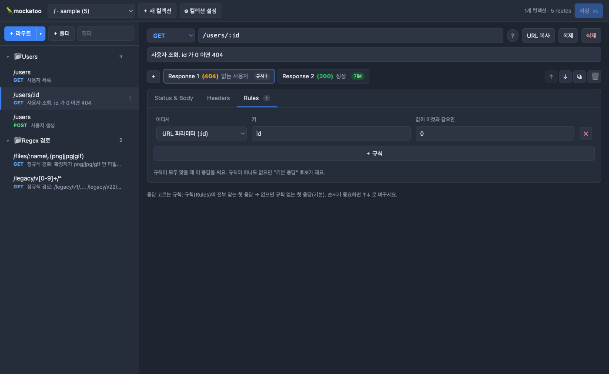
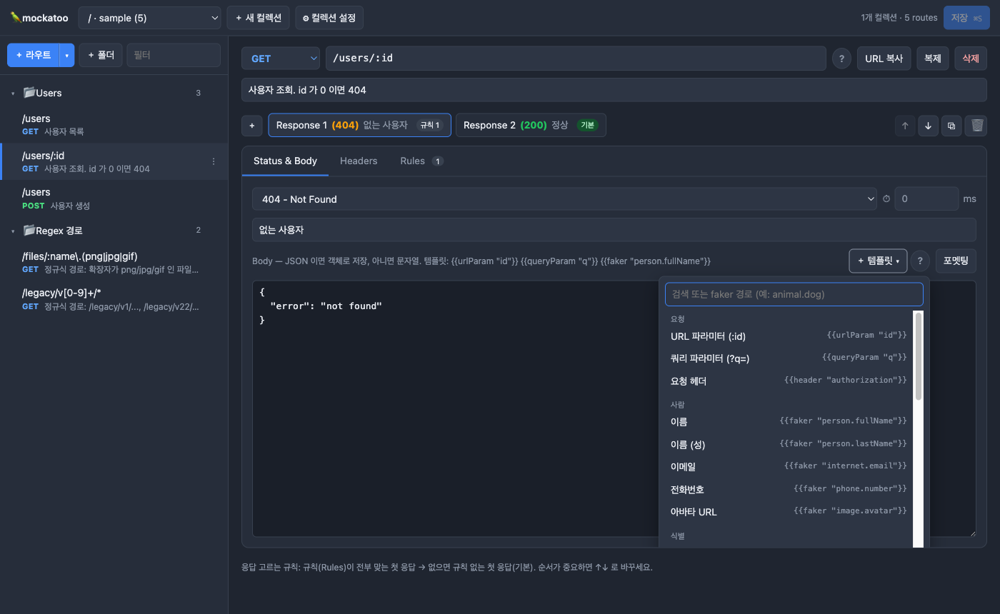
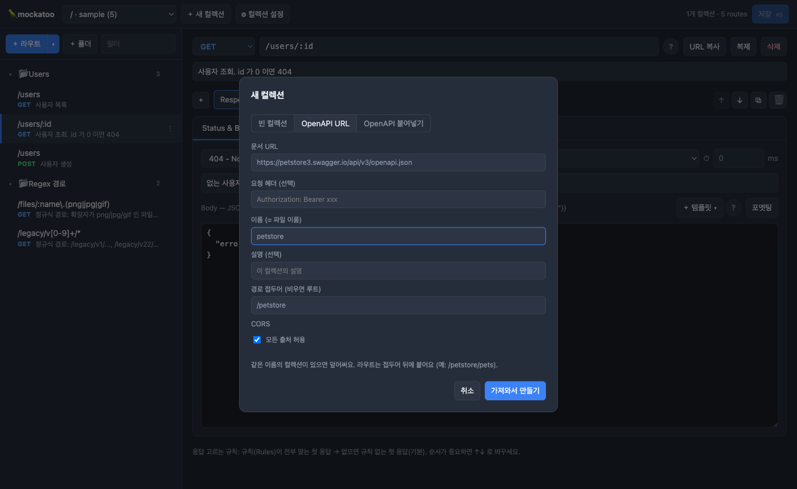
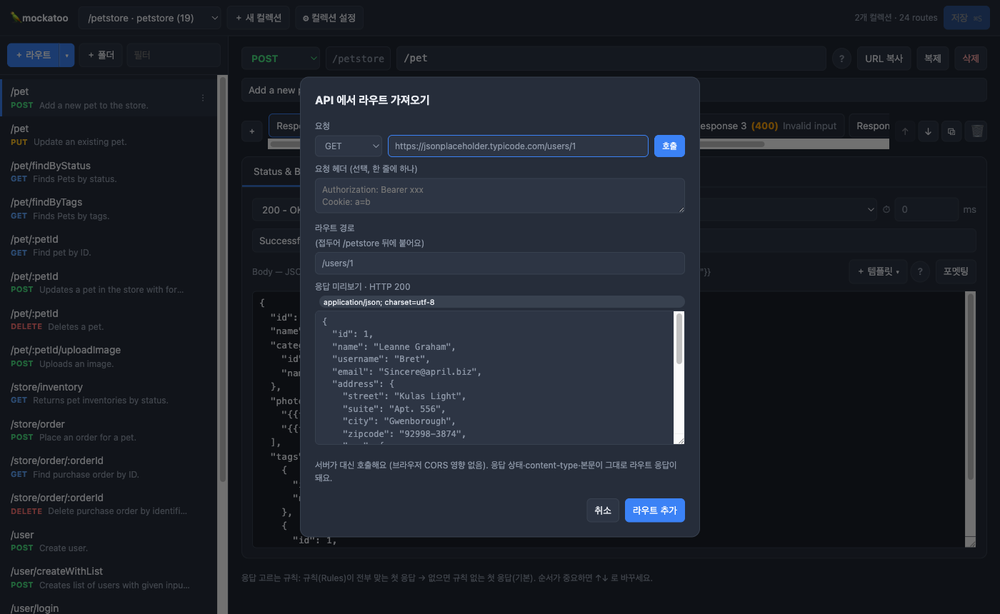

# mockatoo

[English](README.md) · **한국어**

JSON 파일 기반 mock API 서버. 어드민 UI 포함.

> **mock** + **cockatoo**(앵무새) — 앵무새처럼, 가르쳐 준 응답을 그대로 따라 말한다.



## Live demo

설치 없이 바로 써볼 수 있다 (Render 무료 인스턴스라 첫 요청은 깨어나는 데 시간이 걸릴 수 있다):

- 어드민: [https://mockatoo.onrender.com/__admin/](https://mockatoo.onrender.com/__admin/)
- Mock API: [https://mockatoo.onrender.com/users](https://mockatoo.onrender.com/users) · [https://mockatoo.onrender.com/users/1](https://mockatoo.onrender.com/users/1)

```sh
curl https://mockatoo.onrender.com/users/1
# {"id":"1","name":"Kyle Hills","email":"Kyle.Hills@yahoo.com"}
```

## Getting started

```sh
pnpm install
pnpm dev
```

```sh
curl localhost:4000/users/1
# {"id":"1","name":"Kyle Hills","email":"Kyle.Hills@yahoo.com"}

curl localhost:4000/users/0
# 404 {"error":"not found"}
```

어드민: [http://localhost:4000/__admin/](http://localhost:4000/__admin/)

## Features

- 손쉬운 라우트 편집 가능: 어드민에서 편집, 저장, 즉시 반영. 파일을 직접 고쳐도 자동 리로드
- 라우트별 다중 응답 사용 가능: 룰 기반으로 응답 선택
- 응답 지연(ms), 커스텀 헤더, CORS 모사 가능
- 응답값 템플릿 사용 가능: `{{urlParam "id"}}`, `{{queryParam "q"}}`, `{{header "x"}}`, `{{body.field}}`, `{{faker "person.fullName"}}`
- path 정규식 사용 가능: `/users/:id`, `/files/*`, `/v[12]/users`
- 컬렉션 자동 생성 가능: OpenAPI 3 / Swagger 2 → 컬렉션 변환 (URL, 파일, 붙여넣기)
- 라우트 자동 생성 가능: 실제 API 호출 → 응답을 그대로 라우트로 저장
- 컬렉션별 라우트 분리 가능: 컬렉션마다 prefix 를 두고 한 포트에 여러 컬렉션

## Usage

```sh
mockatoo start                                  # data/*.json 을 4000 포트에
mockatoo start -d ./mocks -p 5000
mockatoo start ./api.mock.json                  # 파일 하나만
mockatoo start https://host/openapi.json -n api # data/api.json 없으면 OpenAPI 로 생성

mockatoo import https://host/openapi.json -d data -n api
mockatoo import ./openapi.yaml -o api.mock.json
```


| Option                | Description                                    |
| --------------------- | ---------------------------------------------- |
| `-d, --data <dir>`    | 컬렉션 폴더. 기본 `./data`                            |
| `-n, --name <name>`   | 컬렉션(파일) 이름                                     |
| `-p, --port <port>`   | 기본 `4000`                                      |
| `-H, --header <h...>` | OpenAPI URL 요청 헤더. `"Authorization: Bearer x"` |
| `--no-admin`          | 어드민 끄기                                         |
| `--no-watch`          | 파일 감지 끄기                                       |


빌드 전에는 `pnpm tsx src/cli/index.ts` 가 `mockatoo` 다.

## Admin UI

### Routes

왼쪽 트리에서 라우트를 고른다. 폴더·드래그 정렬은 표시용이고 라우팅과 무관하다.

### Responses

라우트 하나에 응답을 여러 개 둔다. **Rules 가 전부 맞는 첫 응답**, 없으면 **Rules 가 없는 첫 응답**이 나간다.



### Templates

Body 안에서 `{{ }}` 를 쓴다. `＋ 템플릿` 메뉴에서 검색해 넣을 수 있다. faker 는 [fakerjs.dev/api](https://fakerjs.dev/api/) 의 `module.fn` 을 그대로 쓴다.



### Import

`＋ 새 컬렉션` → OpenAPI URL 또는 문서 붙여넣기.



`＋ 라우트 ▾` → `API로 라우트 생성`. 서버가 대신 호출하므로 CORS 영향이 없다.



## Collection file

```json
{
  "name": "demo",
  "prefix": "/demo",
  "routes": [
    {
      "method": "GET",
      "path": "/users/:id",
      "responses": [
        {
          "status": 404,
          "body": { "error": "not found" },
          "rules": [{ "target": "params", "key": "id", "equals": "0" }]
        },
        {
          "status": 200,
          "latencyMs": 100,
          "body": { "id": "{{urlParam \"id\"}}", "name": "{{faker \"person.fullName\"}}" }
        }
      ]
    }
  ]
}
```

- `prefix` — 컬렉션 라우트 앞에 붙는 경로. 비우면 루트. 컬렉션 간 중복 불가, 루트는 하나만
- `rules[].target` — `params` | `query` | `header` | `body`
- `folders`, `folderId`, `description` — 어드민 표시용

## Admin API


|                                                 |                                           |
| ----------------------------------------------- | ----------------------------------------- |
| `GET /__admin/api/status`                       | 서빙 중인 컬렉션                                 |
| `GET /__admin/api/collections`                  | 목록                                        |
| `GET/PUT/DELETE /__admin/api/collections/:name` | 조회 / 저장 / 삭제                              |
| `POST /__admin/api/import`                      | `{ url | text, name, headers?, prefix? }` |
| `POST /__admin/api/probe`                       | `{ method?, url, headers?, body? }`       |


## Docker

```sh
docker build -t mockatoo .
docker run -p 4000:4000 -v $PWD/data:/app/data mockatoo
```

## Development

```sh
pnpm dev        # server
pnpm dev:web    # admin, http://localhost:5173/__admin/
pnpm test
pnpm build
```

## License

MIT